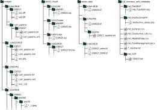

# MuST-C: The Multi-Sensor and Multi-Temporal Dataset of Multiple Crops for In-Field Phenotyping and Monitoring


[**Website**](https://www.ipb.uni-bonn.de/data/MuST-C/) **|** [**Data Repo**](https://bonndata.uni-bonn.de/dataset.xhtml?persistentId=doi:10.60507/FK2/OX9XTM)


This repo contains code pertaining to the data set MuST-C, a mutli-sensor, multi-temporal and multiple crop dataset, consisting of data from sensors:   
* High resolution RGB camera
* Multispectral cameras (10 bands)
* 20x instantaneously-triggered cameras 
* RIEGL miniVUX-SYS LiDAR
* Ouster OS1 multi-beam LiDAR
* LMI laser triangulation scanners, 

and of multiple crops:
* sugar beets
* maize
* potato
* soy beans
* wheat
* wheat - faba bean intercrop

## Quick Start
Our dataset comprises data from multiple sensors over multiple days and multiple crops, and is useful for multiple tasks.
In this example, we show how you can quickly start by performing a simple data processing: sorting all data into plot-level data for a given plot.
Check out the [troubleshooting section](#troubleshoot) if you encounter any problems.

1. Download sample data
We provide a sample of our dataset for you to quickly download, check, and develop with our dataset.  
[Click here to download the sample data.](https://bonndata.uni-bonn.de/api/access/datafile/:persistentId?persistentId=doi:10.60507/FK2/OX9XTM/YDODS9)  
[Metadata about what is included in the sample data is here.](#sample-data)  
2. Uncompress the downloaded ``sample.zip'' to where you want your dataset to be extracted.
  You should get a directory structure like (which is the same as the structure of the complete dataset):
<details>
  <summary>How to unzip in Windows</summary>
  
  1. Install 7-Zip from https://www.7-zip.org/. Although you can manually extract each .zip file without 7-Zip, we recommend you use 7-Zip to automatically extract multiple .zip files.
  2. Open 7-Zip, and navigate to the directory where you downloaded the .zip files. 
  3. Select all the .zip files you wish to extract. Then, click on the ‘Extract’ button at the top ribbon. 
4. Set the directory where you would like to extract. Take note to uncheck the box that would create new directories for each zip file. 
5. Once complete, you will see that the directories follow the structure from the paper. 
</details>
<details>
  <summary>How to unzip in Linux</summary>
  
  1. Download the .zip file(s) to your desired path $PARENT DIR.
  2. Inside the $PARENT DIR directory, run `unzip FILE NAME.zip`, OR \
If you want to unzip all .zip files, run ```bash for fn in *.zip; do unzip -q $fn; done```
</details>
  
```
MuST-C
└───images
└───point_clouds
└───raster_data
└───LAI_biomass_and_metadata
```
3. Clone this repo and install the dev kit. We recommend using a virtual environment or Docker for this.
```bash
git clone https://github.com/PRBonn/MuST-C.git
cd MuST-C/dev_kit
pip install -r requirements.txt
pip install .
```
4. Run the script to extract the data for the plot of id 198 (this is a sugar beet plot) to `output_dir`. This will process all the sensors present in the parent_dir:
```bash
python3 get_plot_data.py \
        --parent_dir <path to downloaded MuST-C> \
        --output_dir <path to extracted plot-wise> \
        --plot_id 198
```
OR: if you are looking for a specific sensor, you can specify the sensor like this:
```bash
python3 get_plot_data.py \
        --parent_dir <path to downloaded MuST-C> \
        --output_dir <path to extracted plot-wise> \
        --plot_id 198 \
        --uav1-rgb \
        --uav2-rgb \
        --uav3-rgb \
        --uav3-ms \
        --ugv-rgb \
        --uav2-lidar \
        --ugv-lmi \
        --ugv-ouster
```
This will process all data from the specified sensor. For example, using the flag `uav1-rgb`, the script will process all the images, point clouds, and raster data, present in `parent_dir`, and will skip any missing files.

## Dataset Download
We provide the URLs to download files based on their sensor modality and data package [here](download_scripts).

You can also download parts of the dataset using the project [website](https://www.ipb.uni-bonn.de/data/MuST-C/)
or the full dataset (~4TB) from the [data repo](https://bonndata.uni-bonn.de/dataset.xhtml?persistentId=doi:10.60507/FK2/OX9XTM).
To use this code base, download the dataset into your desired $PARENT_DIR, while maintaining the directory structure from the downloaded files:



## Developer's Kit
To use our data set, we provide a [developer's kit here](dev_kit),
where we share the scripts used to extract the data shown in our motivating figure (above) and other useful functions.

## Plotting Graphs
To reproduce the graphs in our paper, we provide the relevant [scripts here](plot_graphs_from_paper).

## Code Release
We also provide some scripts we used in the development of our data set:
* [scripts to extract LAI from a sequence of images here](md_Destructive_LAI)
* [script(s) to obtain multispectral reflectance from **UAV3-MS**](UAV3-MS)

## Sample Data
We provide a sample of our dataset [here](https://bonndata.uni-bonn.de/api/access/datafile/:persistentId?persistentId=doi:10.60507/FK2/OX9XTM/YDODS9).
The sample focuses on data from mid-June (around 14.06.2023) for plot 198 of sugar beets.
To keep the filesize reasonably small, we only extracted data of only the plot 198 with the exceptions of the point cloud from **UAV2-Lidar** and all raster data, which comprises the whole field for one date.
If you decide to subsequently download more of the dataset, you can seamlessly extract the new data into the same parent directory because this sample data follows the same directory structure as the complete dataset.

Specifically, this sample contains:
+ images of the plot 198 from **UAV1-RGB** (14.06.2023), **UAV2-RGB** (15.06.2023), **UAV3-RGB** (15.06.2023), **UAV3-MS** (15.06.2023), and **UGV-RGB** (13.06.2023) and their calibration files
+ point clouds of the plot 198 from **UAV1-RGB** (14.06.2023), **UAV2-Lidar** (15.06.2023), **UGV-LMI** (13.06.2023), and **UGV-Ouster** (13.06.2023)
+ raster data from **UAV2-RGB** (15.06.2023), **UAV3-RGB** (15.06.2023), and **UAV3-MS** (15.06.2023). Note that we do not include the raster data from **UAV1-RGB** because this file would be too large.
+ LAI from destructive measurements, LAI from SunScan, and Biomass combined into a single .csv file (LAI\_biomass\_and\_metadata/LAI\_biomass\_combined.csv) for the whole trial period
+ shapefile of the field trial (**md_FieldSHP**)

The sample.zip file is about 5 GB compressed. The uncompressed size is about 7 GB on disc. 

## Troubleshoot
1. Error in installing requirements.txt via pip 
  + We tested the code with Python 3.12 on a Ubuntu 24.04 LTS machine. If you are running on a different OS or Python version, you may need to make some custom changes to adapt to your system.  
  + If you just created a new virtual environment, it could also be worth trying to upgrade your pip `pip install --upgrade pip`
2. The dev kit does not output some files
  + We designed the dev kit to work with subsets of the dataset. If you want to process a specific plot or data type, please first make sure to download and place the necessary data to your $PARENT_DIR
3. How to read the point clouds?
<details>
  <summary>With CloudCompare for quick and easy visualisation and editing</summary>
    
  1. Download CloudCompare from https://www.cloudcompare.org/ and open the CloudCompare software.
  2. Select all the point cloud files. Drag and drop the files into the CloudCompare window. We recommend using the default settings from CloudCompare, so in all options, select "Yes to all"
or "Apply to all".
  3. Click on the "Point picking" icon on the top left, and click on a point of interest. 
    
</details> 

<details>
  <summary>With laspy for Python</summary>
    
  1. Download laspy via pip `pip install laspy` or follow more detailed instructions at their website https://laspy.readthedocs.io/en/latest/installation.html.
  2. In Python, import laspy and open the .las file:
  <pre><code class="language-python">
    import laspy
    plot164 = laspy.read("./plot-wise/plot164/230525-26/point clouds/UAV2-Lidar/230526.las")
  </code></pre>
  3. Check the values in the point cloud:
  <pre><code class="language-python">
    print(plot164.x)
    print(plot164.y)
  </code></pre>
</details>

<details>
  <summary>With QGIS for geographic Information System (GIS) functionalities</summary>
    
  1. [Download QGIS](https://ftp.osuosl.org/pub/osgeo/download/qgis/windows/QGIS-OSGeo4W-3.26.3-1.msi). Note: we recommend using the older version of QGIS Buenos Aires due to current issues with PDAL.
  2. Open the QGIS software, create a new project.
  3. Select all the point cloud files. Drag and drop the files into the QGIS window. (This might take a few minutes)
  4. To see the values of a specific point, you can click on the "Identify Features" at the top and select the point of interest. 
    
</details> 

